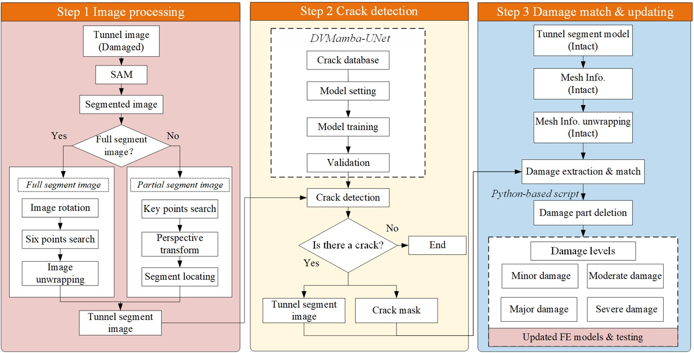
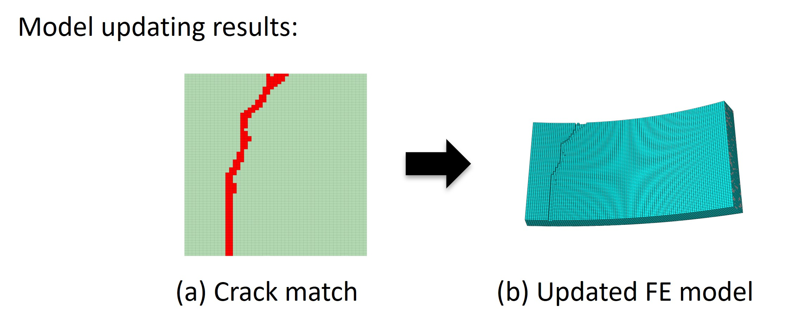

### Structural evaluation of cracked shield tunnels using computer-vision-based model updating techniques

  

  

This research presents a novel **computer-vision-based framework** for evaluating structural damage in cracked shield tunnels by integrating image analysis with **finite element (FE) model updating**. The method uses the pre-trained **Segment Anything Model (SAM)** to segment tunnel components and a newly developed **Dual VMamba U-Net (DVMamba-UNet)** to detect cracks and generate detailed crack masks. **Geometric analysis techniques** then align image-derived damage information with FE models, allowing automatic updates that represent varying damage levels. Two case studies—one with a full tunnel segment image and another with a partial image—demonstrate that the proposed approach can accurately detect and model cracks, assess residual structural capacity, and outperform existing crack detection networks. The study highlights its potential for semi-automated, efficient, and scalable tunnel condition assessment, with strong applicability to Digital Twin frameworks for infrastructure monitoring and management
