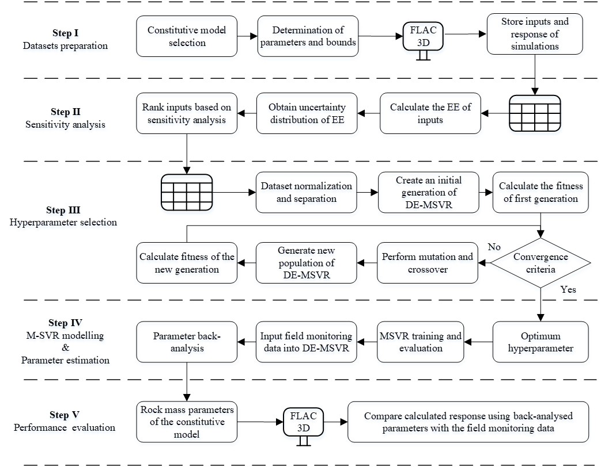
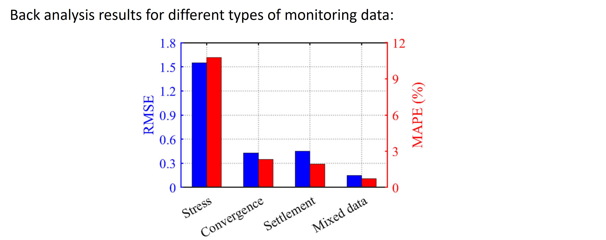

### Back analysis of rock mass parameters in tunnel engineering using machine learning techniques

  

  

This research proposes a new **back analysis method** to improve the estimation of rock mass parameters in tunnel engineering by **combining multi-output support vector regression (MSVR) with a differential evolution (DE) algorithm**. Traditional back analysis approaches are often time-consuming and rely mainly on displacement data, which limits accuracy. The authors enhance prediction by integrating **multiple monitoring data types** (vault settlement, convergence, and rock mass stress) with numerical simulations and **sensitivity analysis** to identify key parameters. The DE algorithm optimizes MSVR hyperparameters, and the method is validated using data from the Yangshan high-speed railway tunnel. Results show that DE-MSVR achieves higher prediction accuracy than existing models and other optimization techniques, particularly when using mixed monitoring data. The study demonstrates that reliable rock mass properties can be estimated even at early excavation stages, though it notes limitations such as the small dataset and lack of dynamic factor consideration
