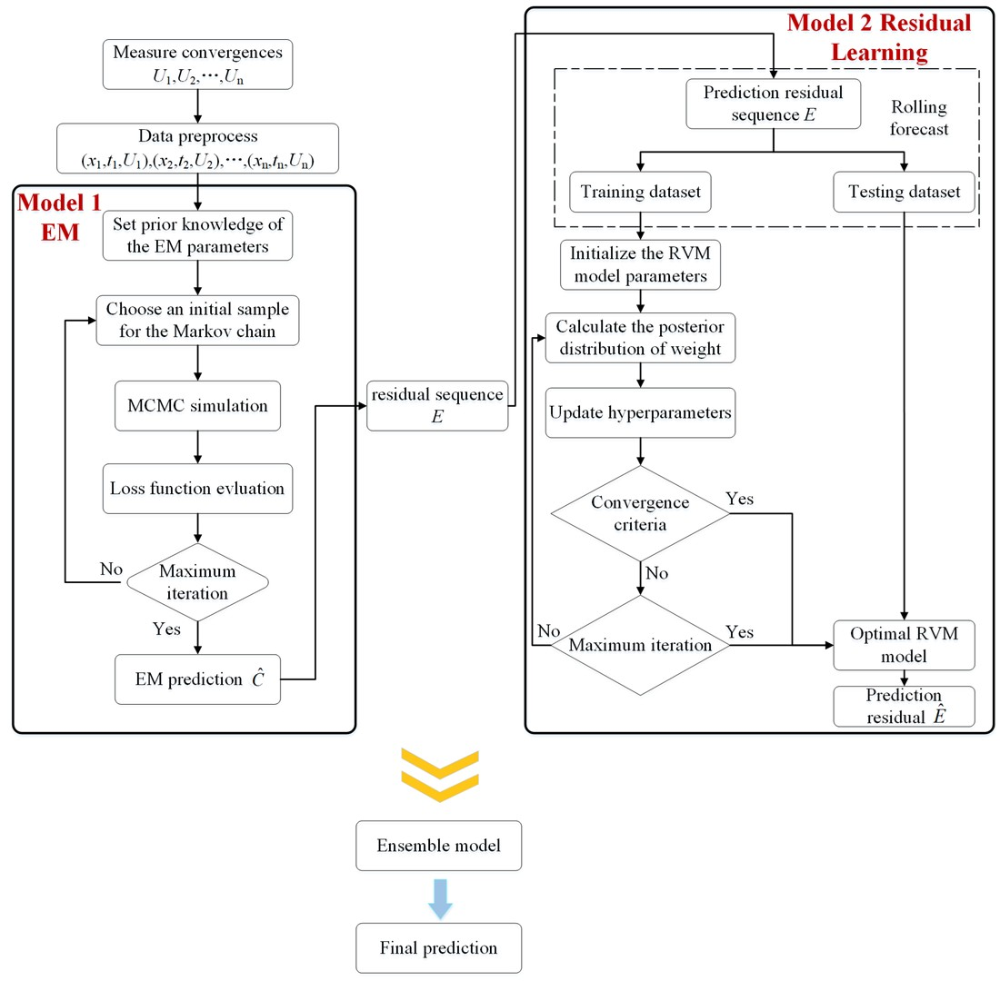
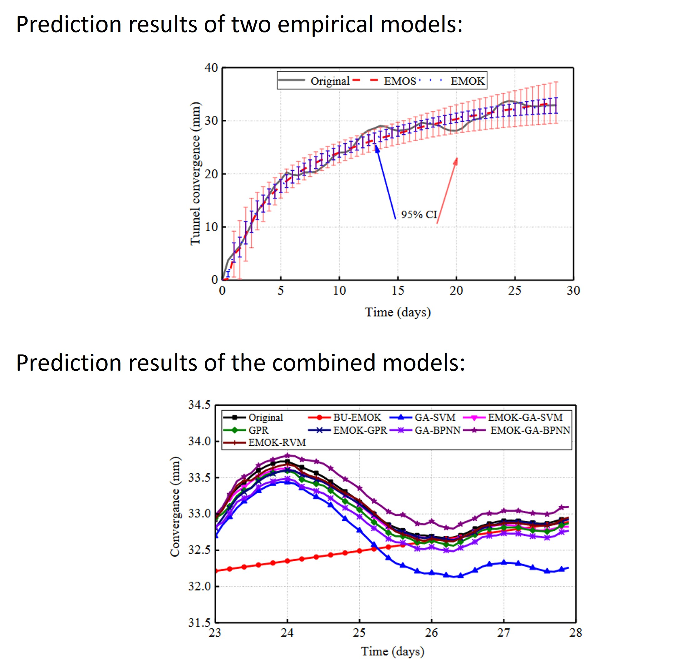

### Bayesian prediction of tunnel convergence combining empirical model and relevance vector machine

  

  

This paper proposes a probabilistic framework for predicting tunnel convergence that combines **empirical models (EMs)**, **Bayesian estimation**, and the **relevance vector machine (RVM)**. Convergence monitoring is essential for ensuring tunnel safety, but traditional numerical models require difficult-to-obtain geological parameters, while empirical models—though simple and efficient—often lack accuracy in complex, nonlinear conditions. To address this, the authors first apply Bayesian estimation with **Markov Chain Monte Carlo simulation** to optimize EM parameters and quantify uncertainties, selecting the most accurate EM. Then, RVM is used to **model and correct residuals** from the EM predictions, improving accuracy. Using data from the Yangshan high-speed railway tunnel in China, the proposed EM–Bayesian–RVM approach reduced root-mean-squared errors by over 90% compared with standalone EMs and outperformed Gaussian process regression and backpropagation neural networks. The study demonstrates that this hybrid method not only retains the simplicity of EMs but also achieves higher accuracy and generalization, offering a reliable tool for tunnel safety monitoring and construction risk management
